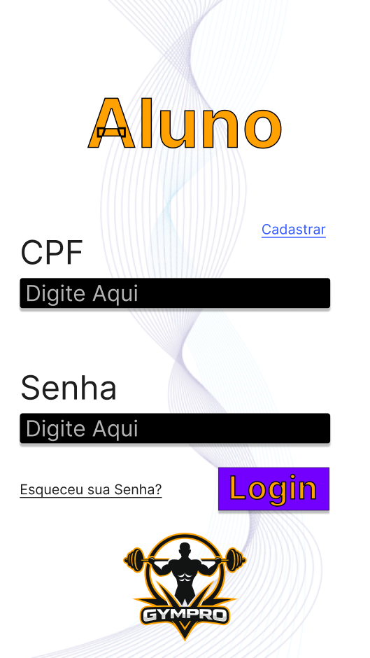
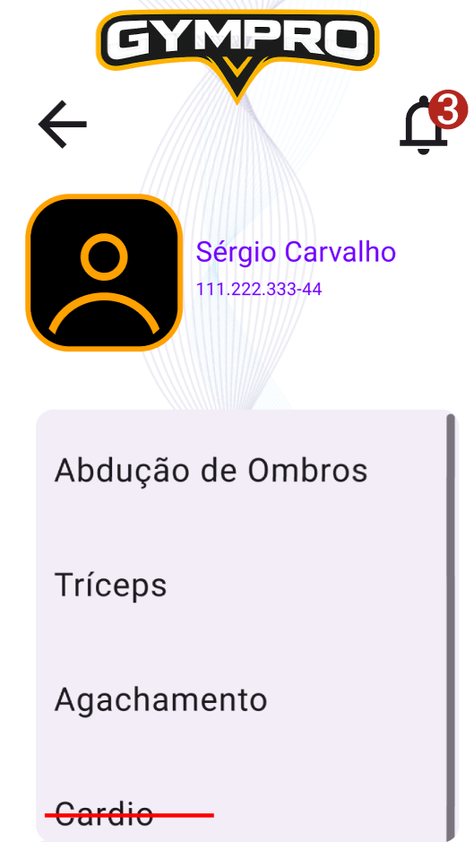
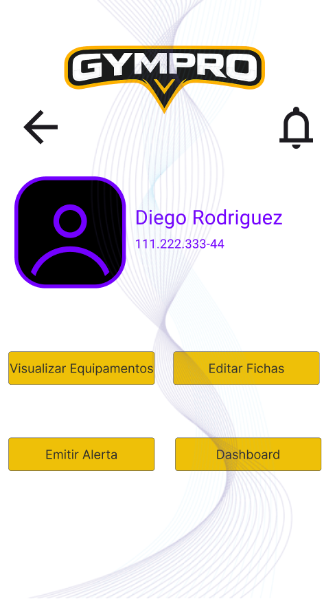
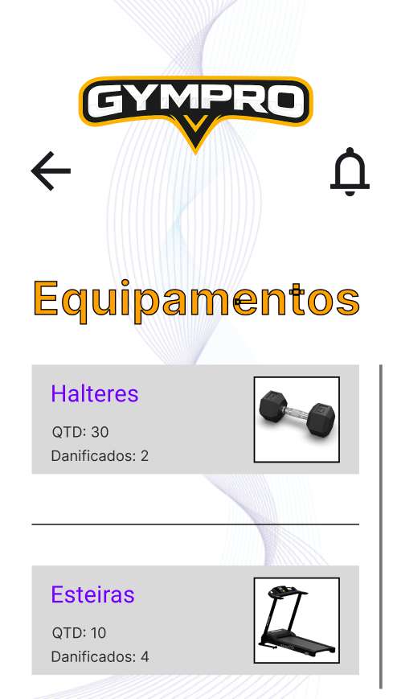
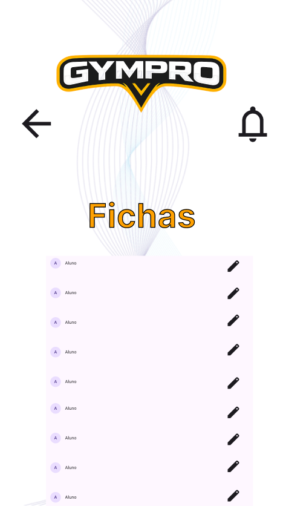
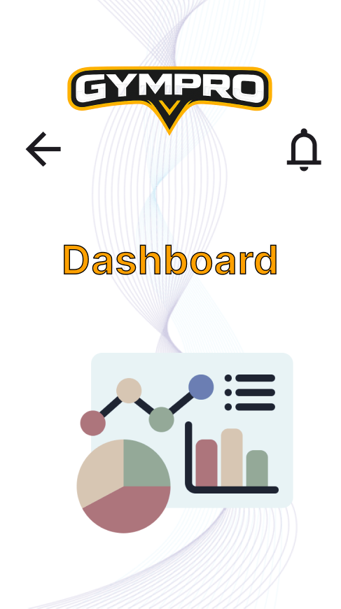

# 3. Projeto de Interface

## 3.1 Wireframes

### O que são wireframes?

Wireframes são protótipos simples que representam a estrutura e o layout básico de um site ou aplicação web, destacando os elementos essenciais da interface e a organização das páginas.

## Wireframes por Tela

### Tela 1 – Escolha do Tipo de Conta

- Tela inicial onde o usuário seleciona seu perfil de acesso como Aluno ou Professor. 
- Atende ao requisito RF-01, permitindo o controle de acesso por perfis, além de contribuir para a usabilidade (RNF-05) ao direcionar o usuário corretamente desde o início.

---

### Tela 2 – Login do Aluno

- Tela responsável pela autenticação do usuário, onde o aluno, ou o professor na tela correspondente, insere suas credenciais para acessar o sistema.
- Relaciona-se diretamente ao RF-01 (autenticação) e ao RNF-02 (segurança), garantindo proteção dos dados através de login seguro.

---

### Tela 3 – Consulta de Ficha

- Tela onde o aluno pode visualizar sua ficha de treino digital com exercícios, séries e instruções.
- Atende ao RF-05, permitindo a visualização das fichas, e considera usabilidade (RNF-03) ao ser acessível em dispositivos móveis.  

---

### Tela 4 – Funcionalidades Exclusivas do Professor

- Tela destinada ao professor, contendo opções para gerenciar equipamentos, fichas de treino, emissão de alertas e dashboard com base nos dados cadastrados.  
- Atende ao RF-04 (CRUD de fichas de treino) e ao RF-02 (gestão de alunos), além de reforçar o controle de acesso por perfil (RF-01).  

---

### Tela 5 – Consulta de Equipamentos

- Tela que exibe a lista de equipamentos da academia, com seus respectivos status.
- Relaciona-se aos requisitos RF-06 (gerenciamento de equipamentos) e RF-08 (status das máquinas).

---

### Tela 6 – Consulta e Edição de Fichas

- Tela onde o professor pode visualizar, editar e atualizar fichas de treino dos alunos.
- Atende ao RF-04, permitindo atualização das fichas, e considera usabilidade (RNF-05) com uma interface prática para edição.

---

### Tela 7 – Emitir Alerta

- Tela para registrar e emitir alertas sobre equipamentos com defeito, necessidade de manutenção ou qualquer outro tipo de aviso que o professor queira compartilhar.  
- Atende ao RF-09 (emissão de alertas) e contribui para o controle de manutenção (RF-07).

---

### Tela 8 – Dashboard

- Painel geral voltado para a gerência, exibindo informações como alunos inadimplentes e status de manutenção. 
- Atende ao RF-10 (dashboard gerencial) e melhora a tomada de decisão, além de considerar desempenho (RNF-01) e organização visual (RNF-05).

 
> **Links Úteis**:
> - [Ferramentas de Wireframes](https://rockcontent.com/blog/wireframes/)
> - [MarvelApp](https://marvelapp.com/developers/documentation/tutorials/)
> - [Balsamiq](https://balsamiq.com/)

