# 5. Projeto da Solução

Pré-requisitos: <a href="4-Gestão-Configuração.md"> Planejamento do Projeto</a>

## 5.1 Tecnologias Utilizadas

> Liste todas as tecnologias utilizadas no projeto, com justificativas breves para cada escolha.  
> Este quadro deve ser atualizado sempre que novas ferramentas forem adicionadas ou substituídas.

| Categoria             | Tecnologia/Ferramenta | Justificativa de uso |
|-----------------------|------------------------|----------------------|
| Linguagem             | TypeScript             | Implementação das funcionalidades do front-end. |
| Framework Front-end   | Next.js               | Criação de interfaces dinâmicas e reutilizáveis. |
| Banco de Dados        | SQLite                  | Armazenamento e gerenciamento de dados. |
| Ferramenta de Design  | Figma                  | Criação de protótipos e wireframes. |
| IDE                   | VS Code                | Ambiente principal de desenvolvimento. |

---

## 5.2 Acompanhamento das Interfaces do Sistema

> Esta seção deve funcionar como **registro contínuo do progresso** do projeto.  
> Inclua sempre **descrição**, **status**, **data de atualização** e **imagem real** da tela.

### 📋 Quadro de Progresso das Telas

| Requisito/Tela                | Status | Última atualização | Próxima entrega |
|--------------------------------|--------|--------------------|-----------------|
| Tela Principal                 | 🟢 Concluída     | 28/05/2026         | -               |
| Telas de Login                  | 🟢 Concluído | 28/05/2026         | -      |
| Tela do Aluno   | 🟢 Concluído | 28/05/2026                  | -     |
| Tela do Professor                 | 🟢 Concluída     | 28/05/2026        | -               |
| Tela da Manuntenção                  | 🟢 Concluído | 28/05/2026         | -      |
| Tela do Financeiro   | 🟢 Concluído | 28/05/2026               | -     |
| Tela dos Equipamentos                 | 🟢 Concluída     | 28/05/2026         | -               |
| Tela dos Alertas                  | 🟢 Concluído | 28/05/2026         | -      |
| Tela da Dashboard    | 🟢 Concluído | 28/05/2026                  | -     |

Legenda: 🟢 Concluído | 🟡 Em andamento | 🔴 Não iniciado

---

### 5.3 Registro Visual das Telas

#### 5.3.1 Tela principal do sistema
**Descrição:** Introdução ao site junto com as opções de Login.  

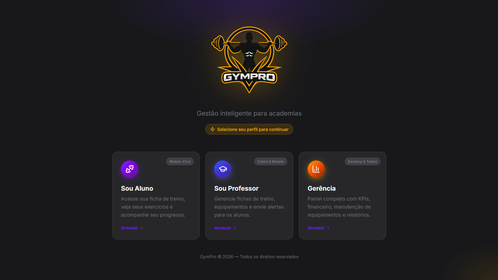

[`Tela principal do sistema`](images/preview/screen_01.png)

---

#### 5.3.2 Telas de login
**Descrição:** Permite acesso de usuários registrados conforme o tipo de conta.  

[`Tela de Login do Aluno`](images/preview/screen_02.png)

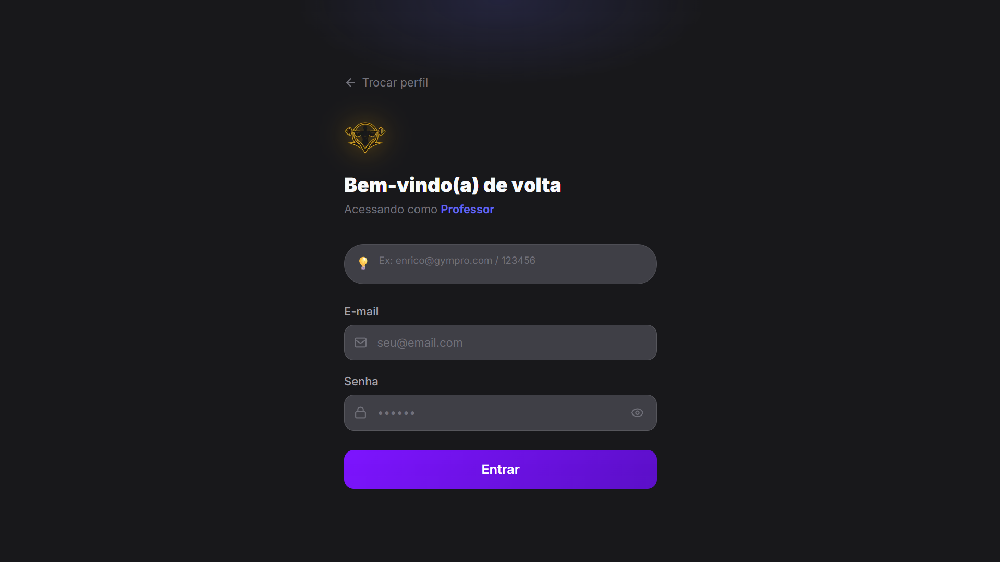

[`Tela de Login do Professor`](images/preview/screen_03.png)

[`Tela de Login da Gerência`](images/preview/screen_04.png)

---

#### 5.3.3 Telas do Aluno
**Descrição:** Permite os alunos visualizarem suas fichas de treino e seus alertas.  

#### 5.3.3.1 Início (Aluno)
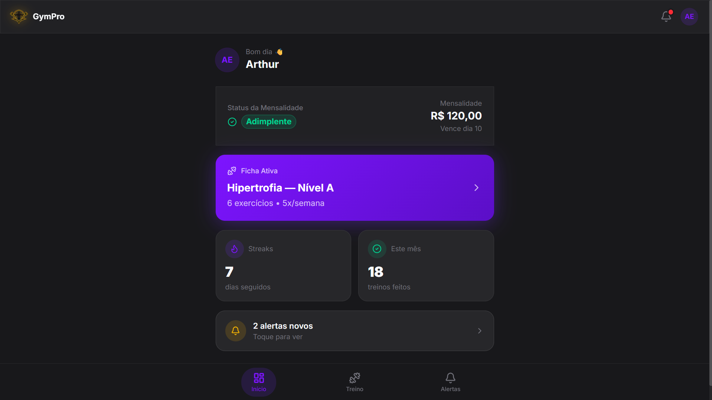

[`Tela de Início do Aluno`](images/preview/screen_05.png)

#### 5.3.3.2 Ficha de Treino (Aluno)
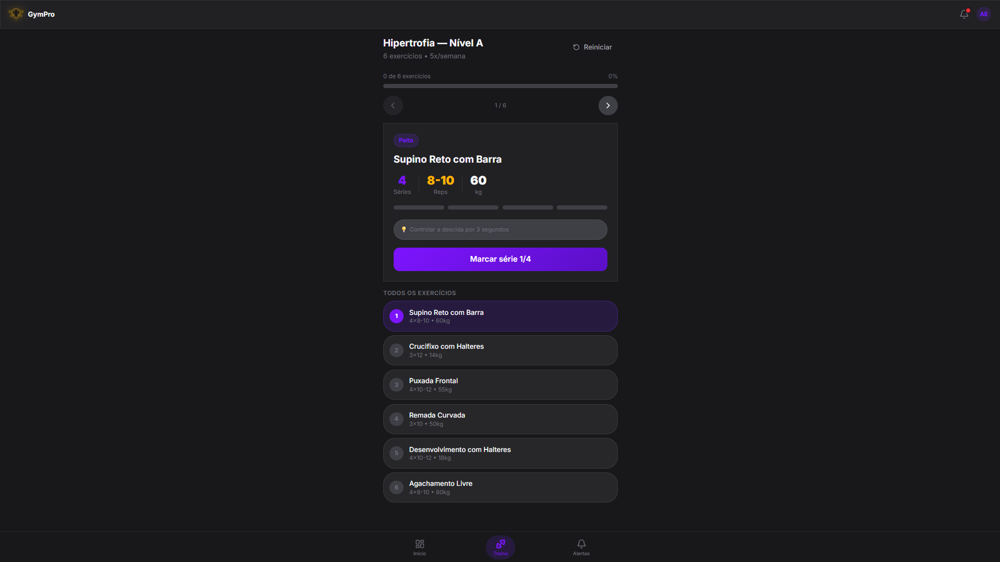

[`Tela de fichas de treino do Aluno`](images/preview/screen_06.png)

#### 5.3.3.3 Caixa de Alertas (Aluno)
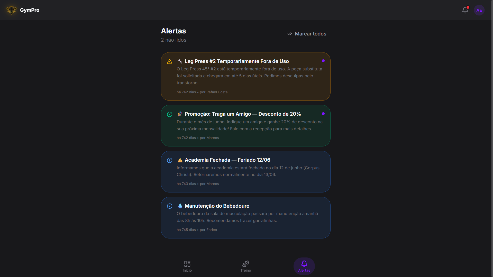

[`Tela de Caixa de Alertas do Aluno`](images/preview/screen_07.png)

---

#### 5.3.4 Telas do Professor
**Descrição:** Permite o professor visualizar seus alunos, editar suas fichas, ver os equipamentos da academia e ver ou criar alertas.

#### 5.3.4.1 Início (Professor)
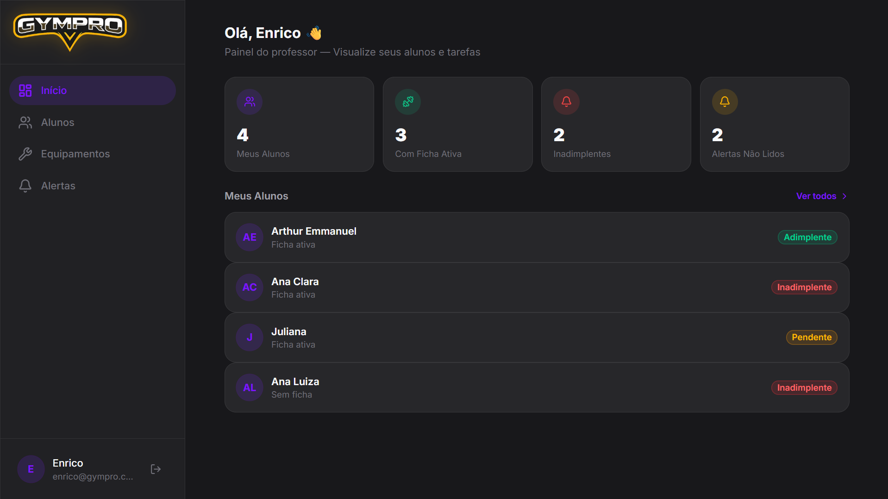

[`Tela de Início do Professor`](images/preview/screen_08.png)

#### 5.3.4.2 Lista de Alunos
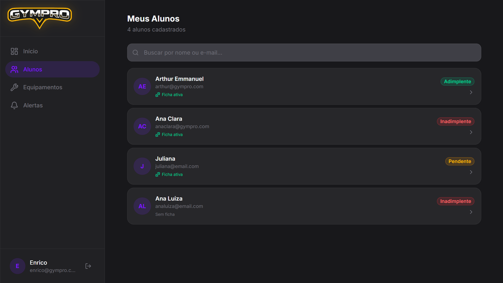

[`Tela da Listagem de Alunos do Professor`](images/preview/screen_09.png)

#### 5.3.4.3 Lista de Equipamentos
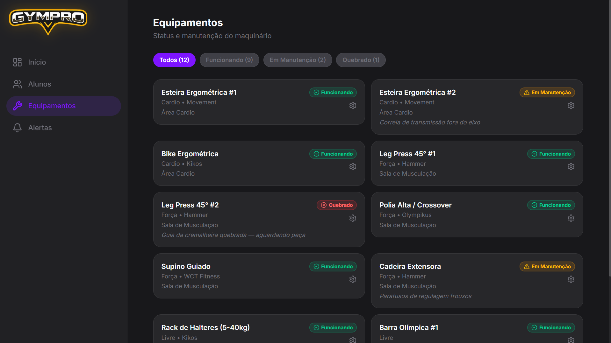

[`Tela da Listagem dos Equipamentos`](images/preview/screen_10.png)

#### 5.3.4.4 Lista de Equipamentos - Editar Equipamento
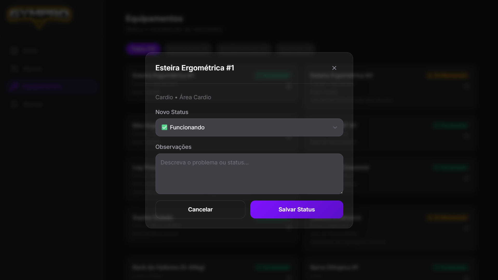

[`Tela da Listagem dos Equipamentos (editar)`](images/preview/screen_11.png)

#### 5.3.4.5 Caixa de Alertas (Professor)
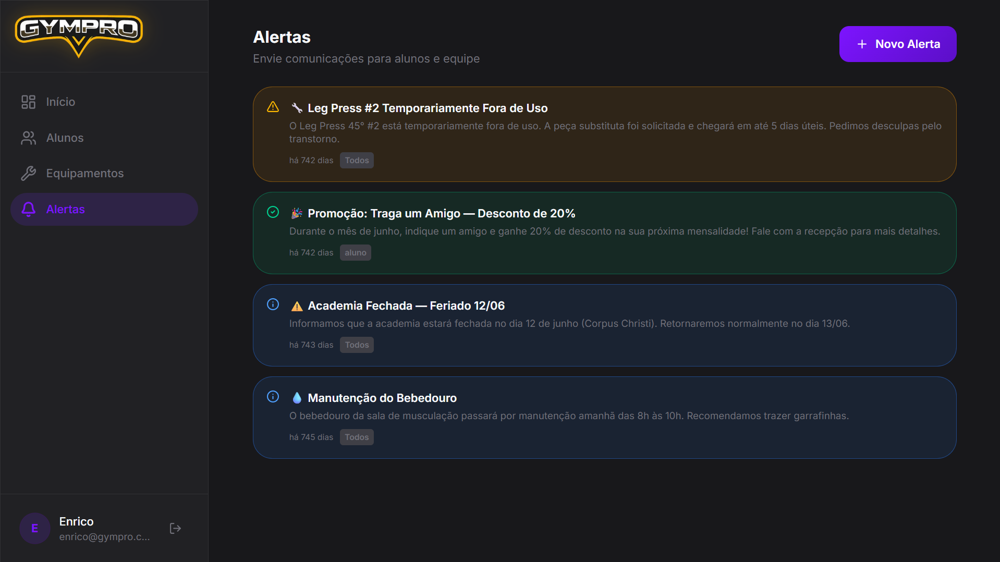

[`Tela de Caixa de Alertas do Professor`](images/preview/screen_12.png)

#### 5.3.4.6 Caixa de Alertas (Professor) - Criar Alerta
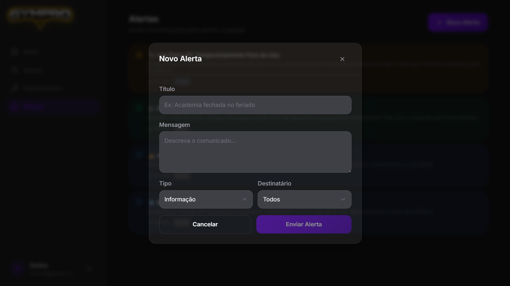

[`Tela de Caixa de Alertas do Professor (criar)`](images/preview/screen_13.png)

---

#### 5.3.4 Telas da Gerência
**Descrição:** Permite a Gerências ver a dashboard, a área financeira e os equipamentos da academia que necessitam de manuntenção.

#### 5.3.4.1 Dashboard
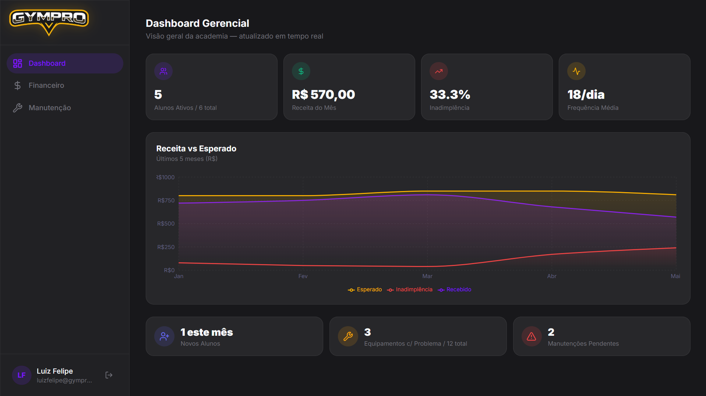

[`Tela da Dashboard`](images/preview/screen_14.png)

#### 5.3.4.2 Financeiro
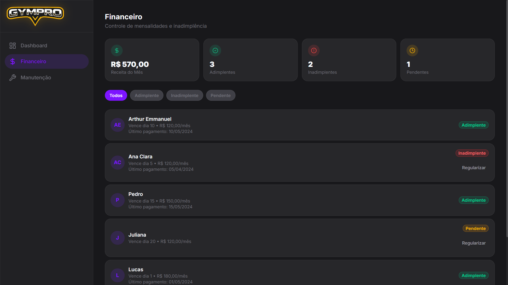

[`Tela da parte Financeira`](images/preview/screen_15.png)

#### 5.3.4.3 Manuntenção
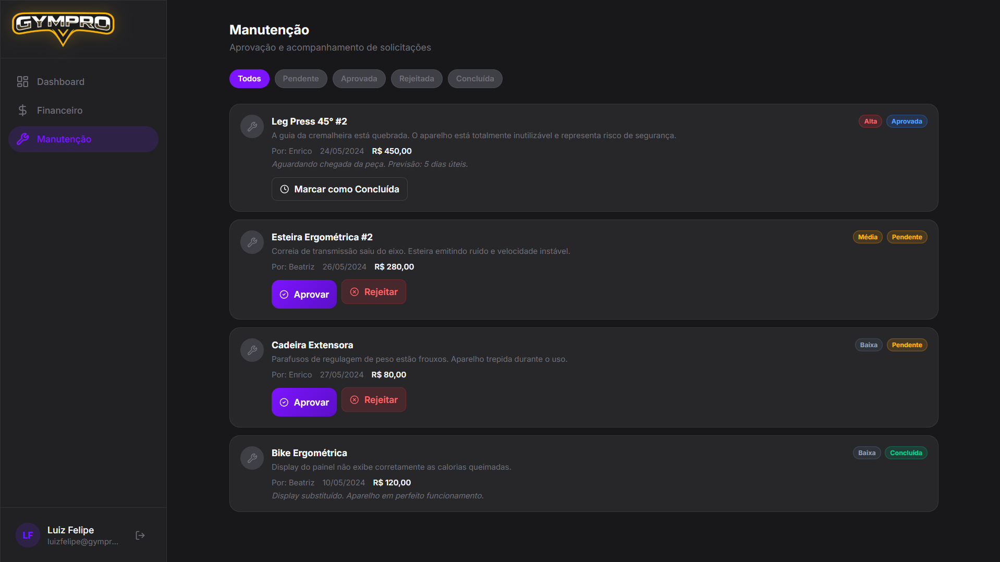

[`Tela da Listagem de Manuntenção`](images/preview/screen_16.png)
